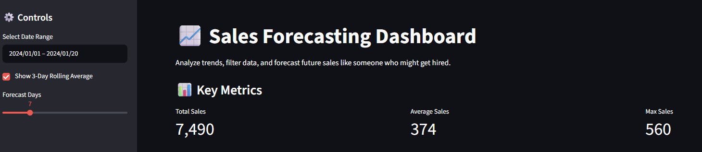
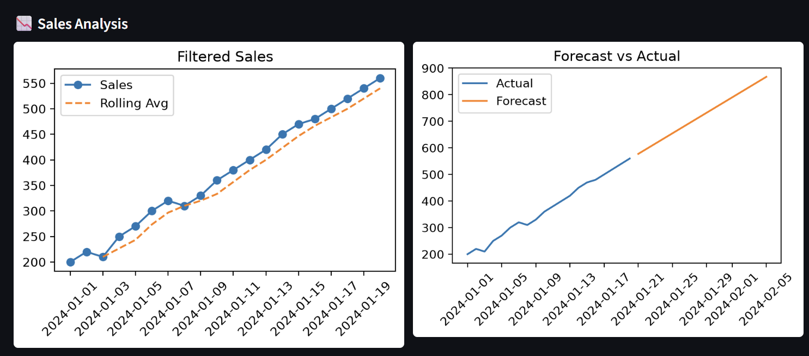
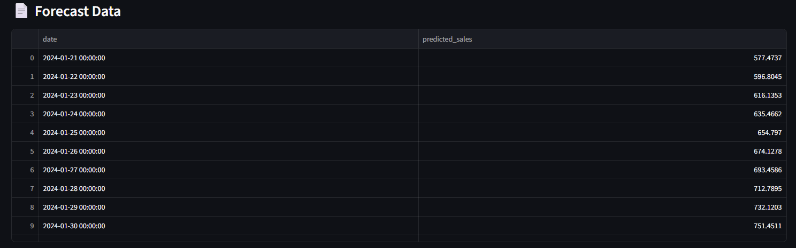

# 📈 Sales Forecasting Dashboard

An interactive Streamlit dashboard for analyzing historical sales data and forecasting future trends using machine learning.

This project demonstrates time series handling, regression-based forecasting, and interactive data visualization.

---

## 🚀 Features

* 📊 Interactive sales dashboard
* 📅 Date range filtering
* 📉 Rolling average (trend smoothing)
* 🔮 Future sales forecasting
* 📈 Side-by-side visualization (Actual vs Forecast)
* 📄 Forecast data table
* ⬇️ Download predictions as CSV

---

## 📸 Screenshots

### 📊 Dashboard Overview



### 🔮 Forecast Visualization



### 📄 Forecast Data & Download



---

## 🧠 Machine Learning Approach

* **Model**: Linear Regression
* **Technique**:

  * Convert date → numerical index (time series transformation)
  * Train regression model on historical sales
  * Predict future values based on trend

---

## 📊 Dataset Format

```csv
date,sales
2024-01-01,200
2024-01-02,220
2024-01-03,210
```

---

## ⚙️ Installation

```bash
git clone https://github.com/sid7shetty/sales-forecasting-dashboard.git
cd sales-forecasting-dashboard
python -m venv .venv
```

### Activate environment

**Windows**

```bash
.venv\Scripts\activate
```

**Mac/Linux**

```bash
source .venv/bin/activate
```

### Install dependencies

```bash
pip install -r requirements.txt
```

---

## 🏋️ Train Model

```bash
python train_model.py
```

This creates:

```
model.pkl
```

---

## ▶️ Run App

```bash
streamlit run app.py
```

Open:

```
http://localhost:8501
```

---

## 📁 Project Structure

```
sales-forecasting-dashboard/
│
├── app.py
├── train_model.py
├── sales_data.csv
├── model.pkl
├── requirements.txt
├── README.md
├── screenshots/
│   ├── 01-dashboard.png
│   ├── 02-forecast.png
│   └── 03-batch-analysis.png
```

---

## 🛠️ Tech Stack

* Python
* Streamlit
* Pandas
* NumPy
* Scikit-learn
* Matplotlib

---

## 🔮 Future Improvements

* ARIMA / Prophet forecasting models
* Seasonality detection
* Real-world dataset integration
* Deployment (Streamlit Cloud)
* Advanced analytics dashboard

---

## 👨‍💻 Author

Siddharth Shetty
M.Sc. Artificial Intelligence
BTU Cottbus-Senftenberg
